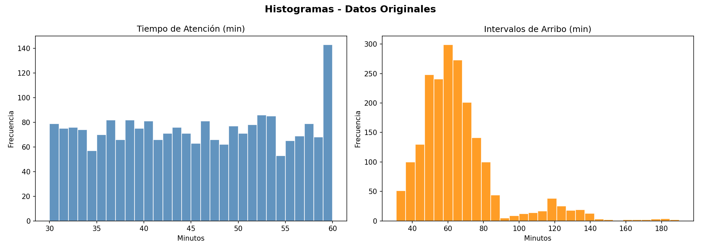
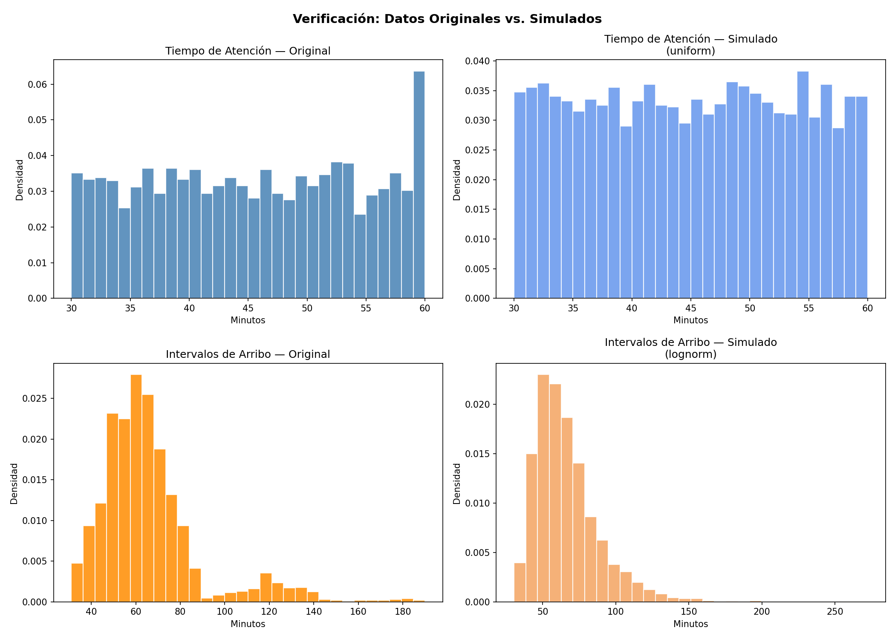

# 💈 Simulación de Barbería con Sistema de Turnos

**Trabajo Práctico N°4 — Simulación**  
*Universidad Tecnológica Nacional — Facultad Regional Buenos Aires*  
*Grupo 9*

---

## 📌 Descripción

Modelo de simulación de eventos discretos para una barbería con **N puestos de atención** que operan de lunes a sábado, de **9:00 a 20:00** (660 min/día). Cada puesto maneja turnos de **60 minutos**, y los clientes eligen siempre el puesto con **menor tiempo comprometido (TC)** — en caso de empate, gana el de menor índice.

El sistema fue diseñado para responder una pregunta clave: *¿cuántos puestos se necesitan para minimizar la espera sin derrochar capacidad instalada?*

---

## 🧮 Variables del Modelo

| Variable | Descripción | F.d.P. | Parámetros |
|----------|-------------|--------|------------|
| **IA** | Intervalo entre arribos (min) | Lognormal | \(s=0.47,\; \text{loc}=21.66,\; \text{scale}=39.67\) |
| **TA** | Tiempo de atención (min) | Uniforme | \(U(30,\;60)\) |
| **N** | Cantidad de puestos | Control | Ingresado por el usuario |

> Las funciones de densidad se obtuvieron ajustando datos reales de barbería mediante la librería [`Fitter`](https://github.com/cokelaer/fitter) (ver `fdp.py`).

---

## 📊 Métricas de Salida

| Sigla | Significado | Unidad |
|-------|-------------|--------|
| **PPS** | Promedio de permanencia en el sistema | minutos |
| **PE** | Promedio de espera en cola por puesto | minutos |
| **PTO** | Porcentaje de tiempo ocioso por puesto | % |
| **PE20** | Porcentaje de clientes que esperaron > 20 min | % |

---

## 🧬 Flujo de la Simulación

1. Se inicializa el reloj en \(T=0\), con \(TC = [0,0,\dots,0]\) y se programa el primer arribo.
2. En cada evento de arribo:
   - Se genera un nuevo **IA** y se actualiza el tiempo de próxima llegada.
   - Se determina el puesto con **menor TC**.
   - Se genera el **TA** del cliente.
   - Si \(TC_i - T > 20\), se contabiliza en **PE20**.
   - Si el puesto está libre (\(TC_i \leq T\)), se acumula **tiempo ocioso**; si está ocupado, se acumula **espera en cola**.
3. Se actualizan acumuladores y se repite el ciclo hasta alcanzar \(T \geq TF\).
4. Se calculan e imprimen los resultados por puesto y globales.

> La simulación usa un **High Value** (\(TF = 10^9\) minutos) para lograr estabilidad estadística.

---

## 🗂️ Estructura del Repositorio

```
├── codigo.py                              # Motor de simulación principal
├── fdp.py                                 # Ajuste de FDP con Fitter + validación
├── Registro_Turnos_Barberia_Simulacion.xlsx  # Dataset original de turnos
├── Graficos/
│   ├── histogramas_originales.png         # Histogramas de datos reales
│   ├── fdp_tiempo_atencion.png            # FDP ajustada — Tiempo de Atención
│   ├── fdp_intervalos_arribo.png          # FDP ajustada — Intervalos de Arribo
│   └── verificacion_simulacion.png        # Comparación real vs. simulado
├── Diagrama/
│   ├── Diagrama de Flujo.png              # Diagrama de flujo del modelo
│   ├── CI y Subrutinas.png                # Subrutinas de generación de FDP
│   └── Análisis Previo.png                # Análisis exploratorio inicial
├── TP N4 Simulacion.docx                  # Informe completo del TP
├── TP N4 SIMULACION.pptx                  # Presentación del TP
└── README.md                              # Este archivo
```

---

## 🚀 Ejecución

```bash
python codigo.py
```

El programa solicitará la cantidad de puestos \(N\) (entero ≥ 1) y ejecutará la simulación con salida tabular de resultados.

Para visualizar el proceso paso a paso:

```python
resultados = simular(N=3, TF=660, verbose=True)
```

---

## 🧪 Verificación Estadística

El script `fdp.py` realiza un ajuste completo:

1. Carga el dataset de turnos reales (`Registro_Turnos_Barberia_Simulacion.xlsx`).
2. Calcula estadísticas descriptivas y genera histogramas exploratorios.
3. Evalúa **12 distribuciones candidatas** con Fitter y selecciona la mejor por error cuadrático.
4. Genera arrays simulados (\(n=4000\)) con `scipy.stats` y los parámetros obtenidos.
5. Compara visualmente datos originales vs. simulados y re-evalúa el ajuste.

<div align="center">
  
  <p><em>Histogramas de los datos reales de la barbería</em></p>
</div>

<div align="center">
  
  <p><em>Comparación datos reales vs. simulados</em></p>
</div>

---

## 👨‍🔬 Resultados Esperados (guía)

Con \(N = 2\) puestos y \(TF\) alto, se observa típicamente:

| Métrica | Valor aprox. |
|---------|-------------|
| PPS global | ~45 min |
| PE global | ~10 min |
| PTO promedio | ~10 % |
| PE20 global | ~15 % |

> Los valores exactos dependen de la semilla aleatoria. Experimente variando \(N\) para encontrar el punto óptimo entre espera y ociosidad.

---

## 🧰 Requisitos

```txt
Python ≥ 3.8
numpy, pandas, matplotlib, scipy
fitter
```

Instalación rápida:

```bash
pip install numpy pandas matplotlib scipy fitter
```

---

## 👥 Grupo 9

Trabajo práctico realizado en el marco de la materia **Simulación** — cátedra de la UTN·FRBA.

---
